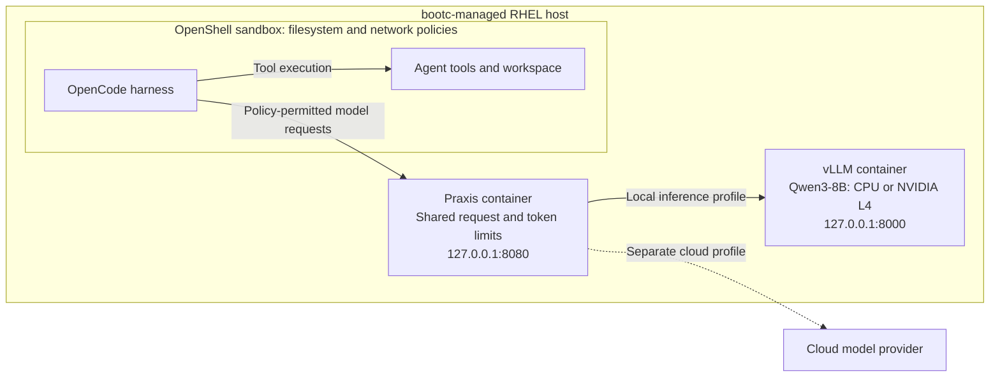

# Secure single-server AI agent environment

AI coding agents become useful when they can read a workspace, run tools, and
call a model. Those are also the powers that make them risky and expensive to
operate: tools can touch unrelated data, model requests can bypass the approved
path, provider keys can spread across harness homes, and one long task can
consume a shared model.

This repository shows how to run those agents on one administrator-managed RHEL
server without giving them that unrestricted power. The harness keeps the
developer experience. OpenShell constrains tools and network access. Praxis owns
model routing and shared usage. vLLM supplies an approved local model. bootc
makes the host reproducible and rollback-capable.

Start with the [architecture value walkthrough](docs/quickstarts/architecture-walkthrough/README.md).
It follows the validated **OpenCode → Praxis → vLLM** path, shows the commands
that prove each boundary, and states what is not yet qualified.

The environment brings together **harnesses, OpenShell, Praxis, and local or
cloud inference**. bootc packages the host setup into an updatable OS image.
The validated local example runs OpenCode through Praxis against Qwen3-8B in a
vLLM container, using either CPU or a single NVIDIA L4.

## How the pieces fit

| Component | Responsibility |
| --- | --- |
| **Harnesses** | Provide the coding-agent experience: prompts, model interactions, and tool calls. Recipes cover several harnesses; supported integrations differ. |
| **OpenShell** | Runs the harness and tools inside a sandbox with declarative filesystem and network policies. |
| **Praxis** | Routes model requests and applies shared request and token limits. Cloud profiles keep provider credentials at the gateway. |
| **Inference backend** | Supplies the model: optional containerized vLLM for local Qwen3-8B, or a cloud provider through a separate Praxis profile. |
| **bootc** | Packages service setup and the selected harness configuration into a reviewed RHEL OS image, with image-based updates and OS rollback. |

Two paths meet at the harness: tools execute within OpenShell's policies, while
model requests travel through Praxis. The diagram shows the validated local
path and the separate cloud-profile option:

The local profile permits sandbox inference traffic only to Praxis. Direct
vLLM and cloud-provider access are denied, and there is no cloud fallback.
CPU and GPU are alternative vLLM modes. OpenCode is the validated harness for
this local path; Codex and OpenClaw local adapters are not enabled.

Pinned workload containers are pulled on first boot and cached across reboots.
Credentials, model caches, and workspace data stay outside the OS image.
OS rollback restores the host deployment; it does not restore application data
or sandbox workspaces.

## Choose a deployment

| Workflow | Where the harness and tools run | Guide |
| --- | --- | --- |
| RHEL with Qwen and optional cloud providers | Ordinary user accounts on all-in-one, or remote clients; CPU/GPU selected independently | [Install local inference](docs/quickstarts/common/vllm.md), then [add providers](docs/quickstarts/common/providers.md) |
| Sandboxed agents with local inference | OpenShell on a bootc-managed server; Praxis routes to CPU or NVIDIA L4 vLLM | [Local Qwen3-8B example](bootc/VLLM.md) |
| Sandboxed harness exploration | OpenShell on the server, with harness-specific policies and provider setup | [OpenShell recipes](openshell/docs/README.md) |
| Shared host with a cloud gateway | Harnesses run directly under OS accounts on RHEL; Praxis owns provider credentials | [All-in-one gateway](docs/quickstarts/all-in-one/README.md) |
| Remote clients with a central gateway | Harnesses and tools stay on client machines; requests reach Praxis over HTTPS with caller JWTs | [Remote gateway](docs/quickstarts/remote-gateway/README.md) |

For OS image creation, start with the [RHEL 9 bootc guide](bootc/README.md).
The current target is x86_64, with a shared base and separate **Codex, OpenCode,
and OpenClaw** OS variants. A harness image being available does not mean every
Praxis/backend combination is supported; consult the
[integration matrix](docs/testing/compatibility.md) and the local
example's validation report.

## Validated today

This is an experimental deployment and validation repository. The strongest
end-to-end example is **OpenCode → Praxis → vLLM** on bootc. AWS tests with
OpenShell `0.1.2-rhaiv.0` passed on CPU and NVIDIA L4, covering real Qwen3-8B
inference, streamed responses, independently verified tool execution, explicit
bypass denials, cached reboot, and disable/re-enable behavior. The
[local inference report](bootc/VLLM-VALIDATION.md) records exact pins and limits,
including the GPU instance's cleanup issue.

The mutable AWS workflow also passed native mocked Qwen/OpenAI/Anthropic
tests. With vLLM 0.30, all-in-one real Qwen tasks passed for Codex, Claude and
OpenCode on both CPU and GPU with the current Praxis image.
See the [compatibility matrix](docs/testing/compatibility.md) for exact pins,
remote-gateway baselines, protocol limits and separate OpenShell results.

Earlier AWS testing also exercised bootc builds, Codex/OpenCode boot and CLI
execution, OS upgrades, a harness switch, and rollback. See the
[host validation record](bootc/VALIDATION.md). The separate sandbox-to-Praxis
cloud-provider path remains under qualification; Codex and OpenClaw reject
Praxis configuration.

The current trust and usage boundaries are explicit:

- OpenShell assumes a trusted single operator. Local management is not a
  multi-tenant authorization boundary.
- Praxis quotas are shared token allowances, not per-user limits or USD budgets.
  bootc uses in-memory quotas; the mutable Praxis deployment offers Valkey for
  persistent token usage.
- CPU inference is functional but slow on the tested eight-vCPU host. Additional
  hardware, sustained load, and coding quality are not qualified by the smoke tests.

See the [OpenShell trust model](openshell/docs/threat-model.md) and
[quota semantics](docs/quickstarts/common/token-quotas.md) for the control boundaries.

## Where this is going

The broader goal is an environment where people can run useful agent tasks
with approved models, controlled workspaces, predictable shared usage, and
repeatable operations. Local inference now provides a tested foundation for
that work. Durable bootc quotas, routing and failover, inference guardrails,
individual and team authorization, retained collaborative sessions, and usage
visibility remain planned or partially implemented capabilities.

The [scope and roadmap](docs/roadmap.md) separates those goals from current
acceptance. To contribute or validate a new combination, use the
[testing guide](docs/testing/README.md).

## Upstream projects

This repository supplies deployment configuration, lifecycle scripts, harness
recipes, and acceptance tests. It consumes [Praxis experimental](https://github.com/praxis-proxy/experimental),
[OpenShell](https://github.com/NVIDIA/OpenShell), and
[vLLM](https://github.com/vllm-project/vllm); it does not implement those runtimes
or the harnesses themselves. The older [Praxis Ruby framework](https://github.com/praxis/praxis)
is a separate project and is not the gateway used here.
